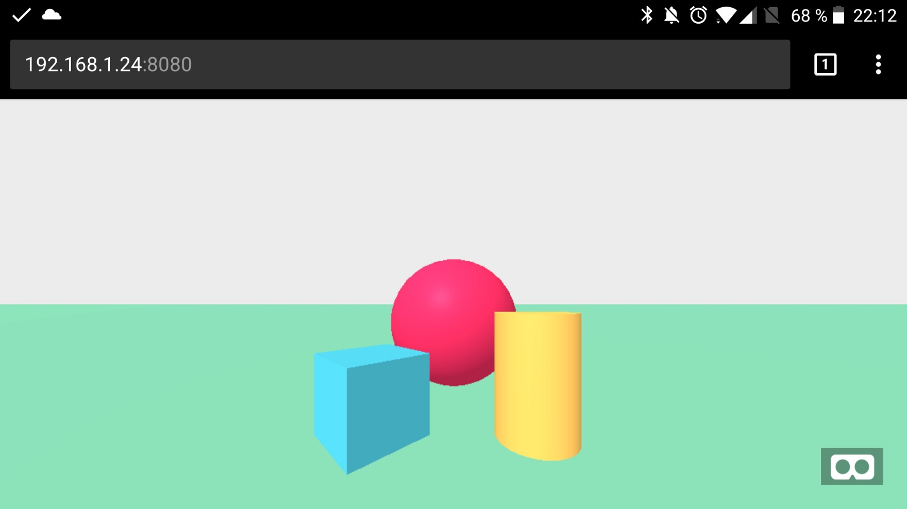
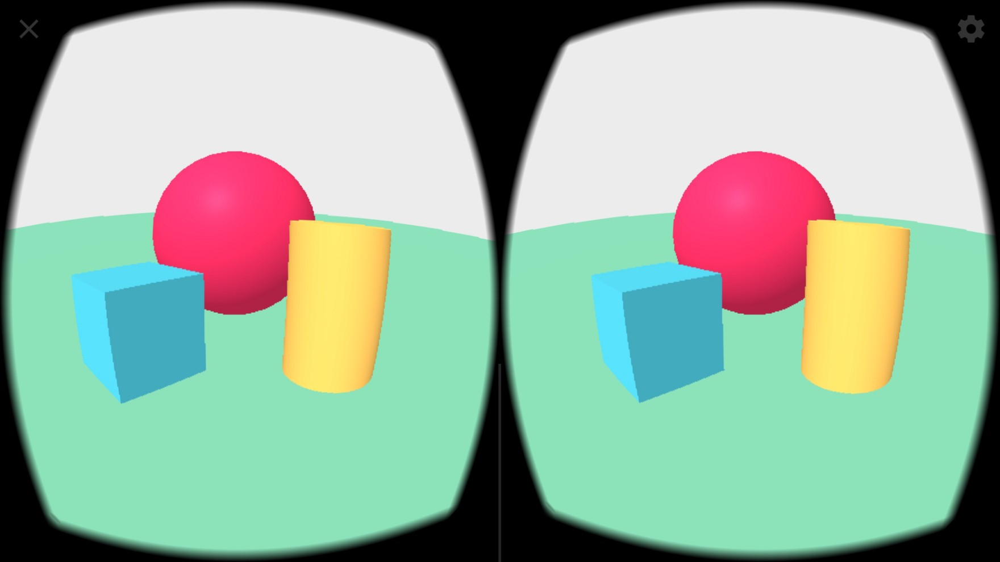

# How to optimize development setup for Google cardboard?

Everytime I work on a project, my first goal is to optimize my development environment in order to be more efficient. I may take some time but it is always profitable.

The default A-Frame is a good start as a basic 3D scene.


And in order to serve this file to my smartphone, I suggest you to  use live-server npm module. It allows the webpage to be automatically reloaded when the code changes and will save you a lot of time.

```bash
$ yarn init -y
$ yarn add live-server
# add live-server as the start script in package.json
$ yarn start
```

So now, you find the ip address of your laptop on your network, be sure your smartphone is connected to the wifi and type the url http://<ip>:8080 in chrome.



Using the small button on the bottom right, you can switch to the cardboard mode.



You insert my smartphone into the Google cardboard and you are now in virtual reality.
However, a painful point still remains. When you change your code, the webpage is reloaded but is not set to the VR mode by default. You still need to remove your smartphone from the Google cardboard, click on button VR mode and insert it again in the Google cardboard.


A good optimization is to map the Google cardboard button with the VR mode button — the Google cardboard button is just an external button that clicks anywhere on your smartphone screen.


This is the code to map the Google card button to the VR button.  

```js
<script>
  function eventFire(el, etype){
    if (el.fireEvent) {
      el.fireEvent('on' + etype);
    } else {
      var evObj = document.createEvent('Events');
      evObj.initEvent(etype, true, false);
      el.dispatchEvent(evObj);
    }
  }
  // only if the url has ?smartphone as a get parameter
  if (window.location.search.substr(1) === 'smartphone') {
    window.addEventListener('click', function () {
        eventFire(document.getElementsByClassName('a-enter-vr-button')[0], 'click')
    })
  }
</script>
```


> Notice that I only map the click if the url has the parameter smartphone. It avoids the mapping on desktop. I also tried to set the VR mode as soon as the page is loaded but as the VR mode is in fullscreen, the browser only accepts action triggered by the user. So full automation is impossible.


At this step, you have a virtual 3D scene ready to rock. Everytime you change your code, the webpage in the smartphone is reloaded and you just need to click on the Google cardboard button to get the latest version in VR mode. In less than 1 second the webpage is up to date and it allows you to iterate a lot to optimize your HUD.
